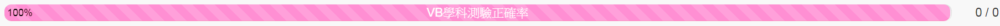
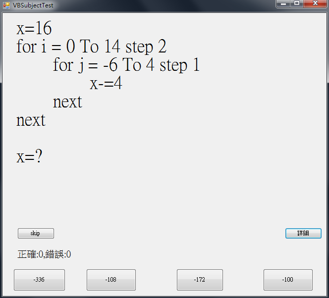
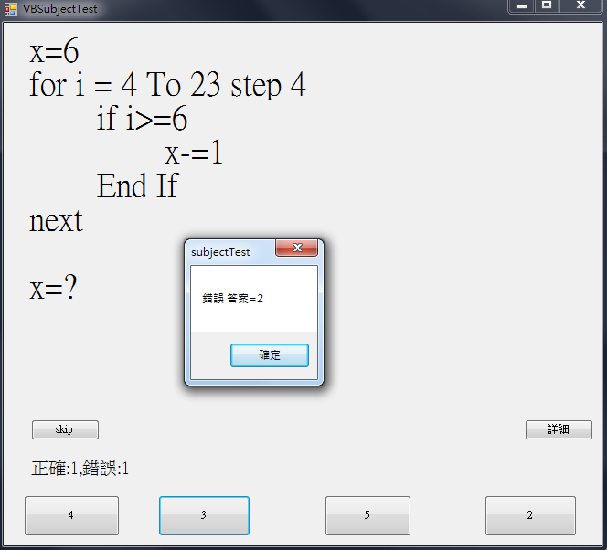
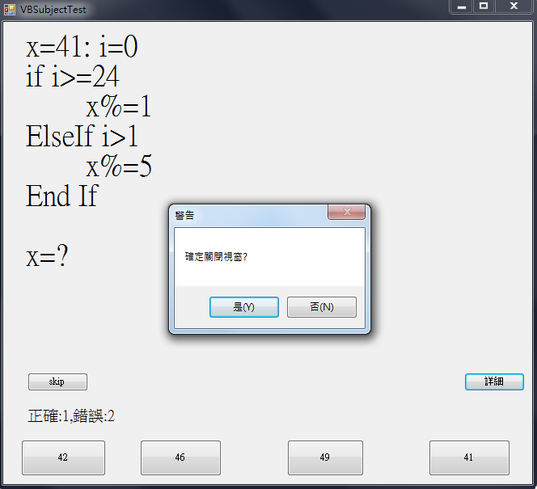
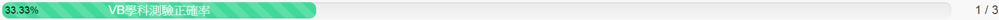
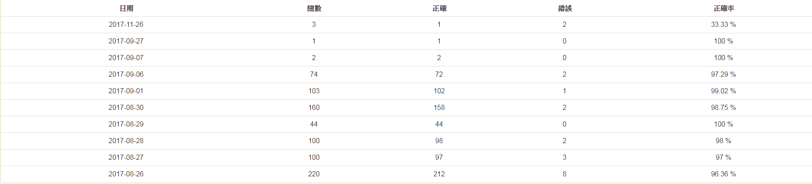

# 學科測驗系統
## 程式碼在 Form1.vb
## 當前有以下題目:
* ## for 迴圈 1~3層
* ## for + if
* ## if + if or if + if else or if else if 等等選擇結構
* ## select case
* ## while 迴圈
* ## while + if or while + if else

## 其他功能
* ## 可以計算正確數及錯誤數
* ## 點擊詳細可以看各類題目正確率及對幾題
* ## 遇到不會的題目可以跳過
* ## 四選一選擇題

# 可結合網站伺服器做紀錄正確率
## 如下圖，假設一開始為100% ，正確與錯誤皆為0

## 程式一開始的介面(題目為亂數產生)

## 如果答對題目會跳出訊息說正確，否則會說錯誤並告訴使用者正確答案。
### 錯誤圖

## 當要把程式關閉時，會跳出提示訊息，關閉後系統將把正確及錯誤資訊上傳到網站伺服器。

## 關閉後，網站上的資訊就改變了。
### 如下圖 (最右邊的數字為 答對數/題目總數)

## 另外也可以配合後端處理，整理歷史紀錄。
