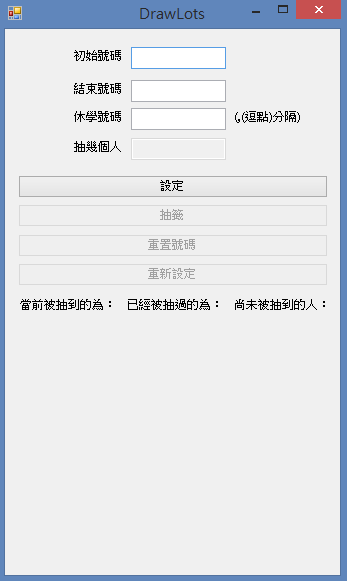
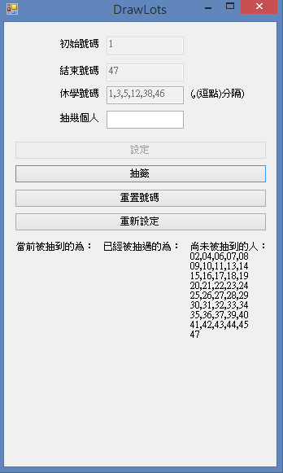
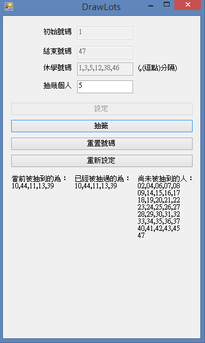
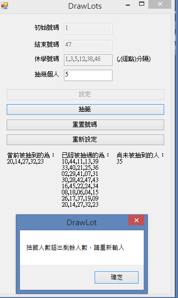

# 抽籤程式
## 程式碼在 Form1.vb

## 程式畫面

## 使用方法:
* ## 輸入班級中的第一個號碼
* ## 輸入班級最後的號碼
* ## 輸入班級中休學的號碼
* ## 點選設定
* ## 輸入抽幾個人
* ## 點選抽籤 or 重置號碼 or 重新設定
## 點選設定之後，如下圖:

## 假設初始為1，最後的號碼為47，且休學號碼如圖，那麼尚未被抽到的人就不會有那些休學的人，假設我一次抽5個人，只要抽幾個人的欄位輸入5，按下抽籤，如下圖:

## 被抽過的人也會自動更新上去，可以看到有誰目前已經被抽過不會再被抽到，除非點下重置號碼，就會保留設定，變為大家還沒被抽過的狀態，而重新設定就可以重新設定號碼，不會有抽超過人數的問題。
## 若抽的人數大於剩餘人數，則會跳出提示訊息，如下圖:

## 此時可點下重置號碼或重新設定。