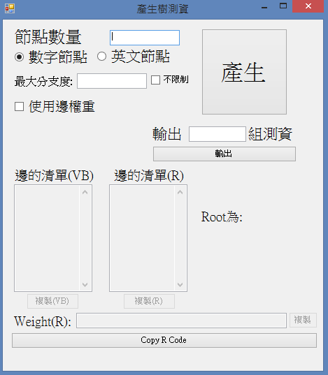
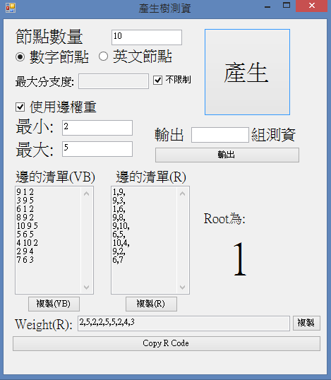
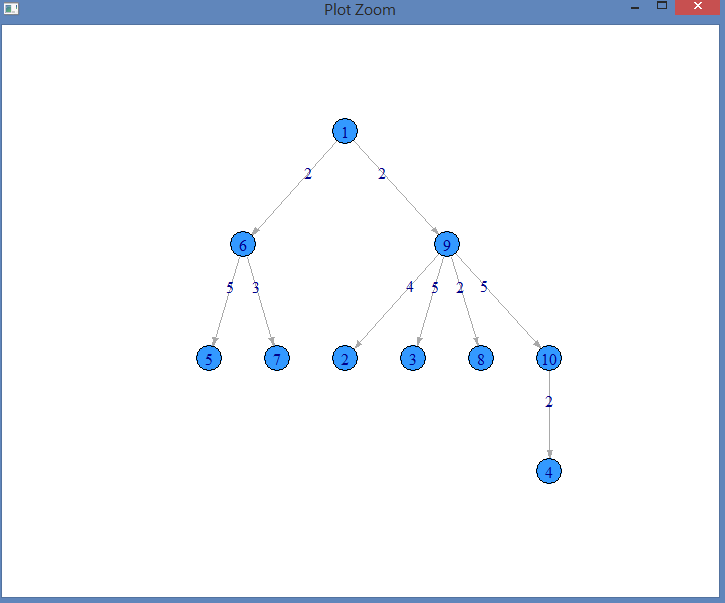
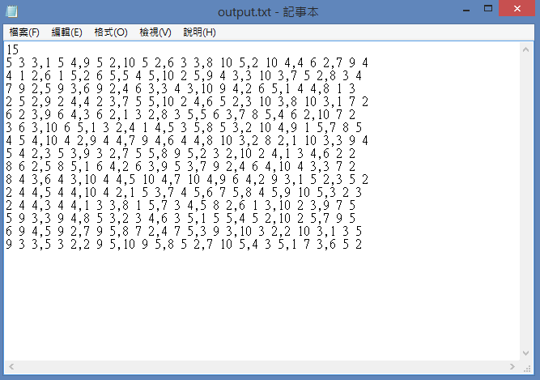

# 產生樹狀結構測試資料
## 程式碼在 Form1.vb

## 程式畫面

## 使用方法:
* ## 先輸入節點的數量
* ## 點選節點為數字或英文
* ## 輸入最大分支度，或勾選不限制
* ## 如果要使用邊權重可以打勾，並輸入最小值與最大值
## 做完以上步驟之後，有幾種輸出方式。
## 一種是單純的按下產生，會產生下圖:
 
## 這一種輸出方式可以一組一組產生測試資料，並且可以與R語言的igraph套件配合，點選複製就可以複製這些資料，最底下有一個按鈕，Copy R Code，就可以直接到Rstudio貼上，Plot出這組資料的Tree，如下圖:

### 或許你會問說，為什麼樹會有邊權重?因為可能有些題目會用到。
## 還有第二種輸出方式，在產生下方有產生___組測資，在其他欄位填寫完成之後，並輸入__組測資的欄位，按下輸出的按鈕，會自動產生一個output.txt的文字檔，所有組資料都符合設定，如下圖輸入15輸出:

## 這樣就有15組同樣規則但不同的測試資料了。

## 這樣做的好處是，當你想要測試程式效能，卻資料組數不夠的時候，可以大量產生樹狀結構的資料。

## 在這邊假設專案存放在於"D:\VB\"，所以output產生在於"D:\VB\產生樹測資\bin\Debug\output.txt"，可在程式最後輸出的路徑修改。